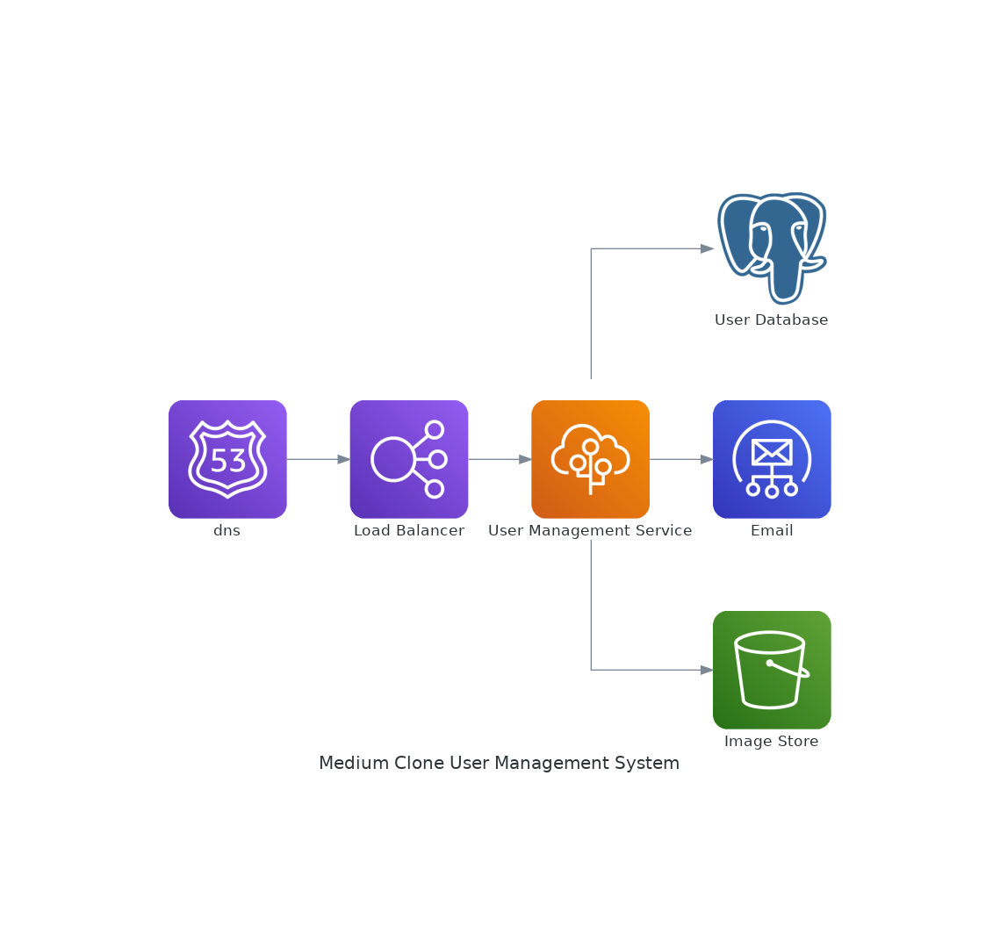

# Medium Clone User Management System

> A standalone service for managing blog application users. This include administrators, authors, readers and moderators.  

<p align="center">
  
  
  
  
  
  
  
  
  
  
  
  
  
  
  
</p>



## Project Overview
This is a web application that manages the users of a blogging application(A Medium clone). The application enables the various users to register as well as manage their accounts (view, update, delete.) Other functionality includes:
1. Authors can report offensive authors
2. Authors can subscribe to other authors and the subscribers can be sent notification emails.
3. Moderators can flag offensive authors and admins can suspend offensive author accounts.

## Working 

It's pretty easy to use the application. On the home page (http://localhost:5000/apidocs):

 1. Create an account (post details through register route)
 2. Send a confirmation email (post email address and user id theough the send_confirm_email route)
 3. Confirm email address (submit the user id and token from step 2)
 4. Log in using the login route (submit your email and password)
 5. Use the access token from step 4 to authorize yourself.
 6. Access other functionalities such as user update, viewing, deletion.


 ## Features

This application has several features including:

1. Deployed to an AWS EBS using Codedeploy.
2. Versioned using git and Hosted on GitHub.
3. Auto-deployed to AWS using AWS CodePipeline.
4. Uses gunicorn as the application servers.
5. Uses an Application Load Balancer to redirect traffic to the frontend
6. Uses AWS SES to send confirmation emails.
7. Uses JWT to authorize users.
8. Uses AWS S3 to store images
9. Uses Celery to upload images to S3 and to send emails.

## Local Setup

Here is how to set up the application locally:

  1. Clone the application repo:</br>

      ```sh
      git clone https://github.com/twyle/Medium-Clone-User-Management-Service.git
      ```

  2. Navigate into the cloned repo:

      ```sh
      cd Medium-Clone-User-Management-Service
      ```

  3. Create a Virtual environment:

      ```sh
      python3 -m venv venv
      ```

  4. Activate the virtual environmnet:

      ```sh
      source venv/bin/activate
      ```

  5. Install the project dependancies:

      ```sh
      pip install --upgrade pip # update the package manager
      pip install -r requirements.txt  
      ```

  6. Create the environment variables for the service:

      ```sh
      touch .env
      ```

      Then paste the following into the file:

      ```sh

        FLASK_DEBUG=True
        FLASK_ENV=development
        FLASK_APP=manage.py

        SECRET_KEY=secret-key

        POSTGRES_HOST=localhost
        POSTGRES_USER=lyle
        POSTGRES_PASSWORD=lyle
        POSTGRES_DB=lyle
        POSTGRES_PORT=5432

        MAIL_USERNAME=<mail-user-name>
        MAIL_PASSWORD=<mail-password>
        MAIL_SERVER=<mail-server>
        MAIL_PORT=465
        MAIL_USE_SSL=True
        MAIL_DEFAULT_SENDER=<default-email>

        S3_BUCKET=<s3-bucket-name>
        AWS_ACCESS_KEY=<aws-access-key>
        AWS_ACCESS_SECRET=<aws-secret-key>

      ```

      Then create the database secrets:

      ```sh
      cd services/database
      touch .env
      ```

      Then paste the following into the file:

      ```sh
        POSTGRES_DB=lyle
        POSTGRES_PORT=5432
        POSTGRES_USER=postgres
        POSTGRES_PASSWORD=lyle
      ```

  7. Start the database containers:

      ```sh
      docker-compose -f database/docker-compose.yml up --build -d
      ```

  8. Create the database migrations:

      ```sh
      flask db migrate -m "Initial migration."
      flask db upgrade
      ```

  9. Start the services:

      ```sh
      python manage.py run
      ```

  10. View the running application

      Head over to http://0.0.0.0:5000/apidocs 

 <p align=center>
  
</p>

## Development

 #### 1. Application Design

  1. **Services**

      The application consists of a single service.

      1. User Management Service 

      
        
        This service is resposible for the registration of new users, as well as the authentication and authorization of registered users. The routes include:

        | Route                   | Method  | Description                 |
        | ------------------------| ------- |---------------------------- |
        | 'api/v1/auth/register/admin'  | POST    | Register a new admin.        |
        | 'api/v1/auth/register/author'  | POST    | Register a new author.      |
        | 'api/v1/auth/register/moderator'  | POST    | Register a new moderator.|
        | 'api/v1/auth/login'     | POST    | Login as a registered user. |
        | 'api/v1/auth/logout'    | POST    | Logout as a logged in user. |
        | 'api/v1/auth/confirm_email'   | GET     | Confirm email address.      |
        | 'api/v1/auth/reset_password'      | POST    | Reset password .      |
        | 'api/v1/user'           | DELETE  | Delete a user.              |
        | 'api/v1/user'           | PUT     | Update user info.           |
        | 'api/v1/user'           | GET     | Get a user's info.          |
        | 'api/v1/users'          | GET     | List all users.             |
        | 'api/v1/admin'           | DELETE  | Delete a admin.              |
        | 'api/v1/admin'           | PUT     | Update admin info.           |
        | 'api/v1/admin'           | GET     | Get a admins info.          |
        | 'api/v1/admins'          | GET     | List all admins.             |
        | 'api/v1/moderator'           | DELETE  | Delete a moderator.          |
        | 'api/v1/moderator'           | PUT     | Update moderator info.        |
        | 'api/v1/moderator'           | GET     | Get a moderators info.        |
        | 'api/v1/moderators'          | GET     | List all moderators.          |
        | 'api/v1/report/author'           | POST     | Report an offensive author.|
        | 'api/v1/report/authors'           | GET     | List reported authors.|
        | 'api/v1/flag/author'           | POST     | Flag an offensive author.|
        | 'api/v1/flag/authors'           | GET     | List flagged authors.|
        | 'api/v1/suspend/author'           | POST     | Suspend an offensive author.|
        | 'api/v1/suspend/authors'           | GET     | List suspended authors.|

        This service uses Postgres to store the user info, AWS S3 to store the images, AWS SES to send the emails and celery for the email sending and photo upload.


  2. **Database**

      The application uses Postgres and AWS S3. The postgres database is used to store user details. The AWS S3 bucket is used to store the profile pictures.

  3. **Security**

      The application uses JSON Web Tokens to authorize access to protected routes. The passwords are also encrypted.

  ## Contribution

1. Fork it https://github.com/twyle/repo-template/fork
2. Create your feature branch (`git checkout -b feature/fooBar`)
3. Commit your changes (`git commit -am 'Add some fooBar'`)
4. Push to the branch (`git push origin feature/fooBar`)
5. Create a new Pull Request

## Developer

Lyle Okoth – [@lylethedesigner](https://twitter.com/lylethedesigner) on twitter </br>

[lyle okoth](https://medium.com/@lyle-okoth) on medium </br>

My email is lyceokoth@gmail.com </br>

Here is my [GitHub Profile](https://github.com/twyle/)

You can also find me on [LinkedIN](https://www.linkedin.com/in/lyle-okoth/)

## License

Distributed under the MIT license. See ``LICENSE`` for more information.
